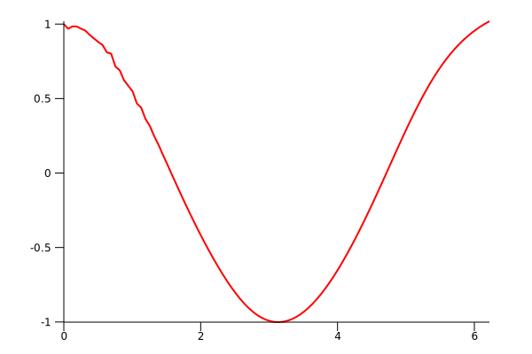

# lumen-examples

## [Iris](./iris)

Use a simple MLP to train iris dataset.

## [Function Fitting](./function_fitting)

Use a simple RNN + Linear net to fit a given function(`fn(f64) -> f64`). There is an example for `cos`, the image show the predict curve after trainng:

